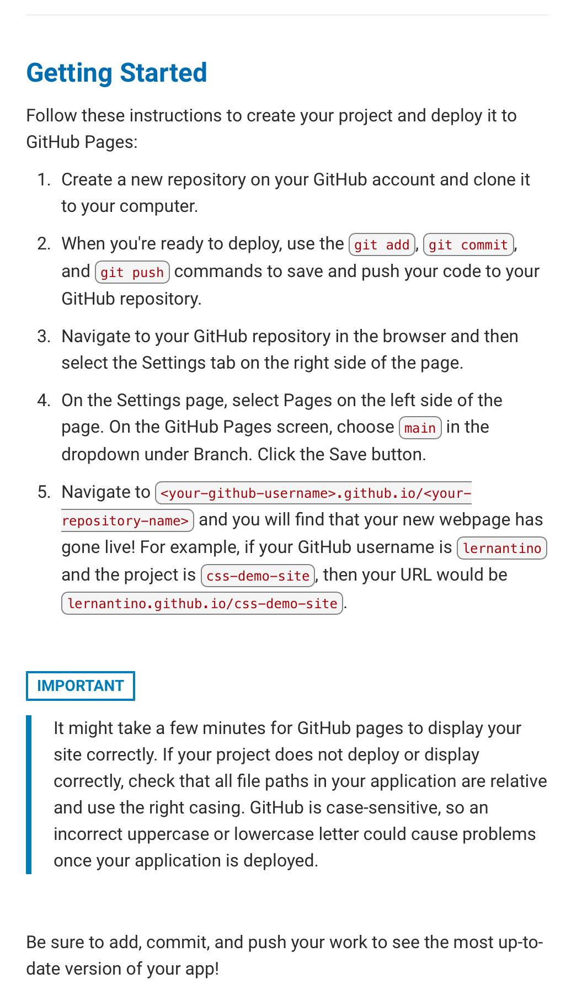

# Horiseon-code-refractor-project

## Description

I looked into HTML & CSS forms on website and refactored the code to make the website more accessible. I decided to simplfy the code in HTML to a more element stance. By doing this, I believe it'll be easier for the computer to reconginze your site, therefore creating more attention and foot traffic towards your marketing agency. I also refactored the code in CSS, which will benefit your websites accessibility. My goal is to provide your business better foot traffic thus creating new and happy clients.

Was provided with Starter Code and a Mock up Image of what website should look like. 

## Table of Contents

- [Installation](#installation)
- [Usage](#usage)
- [User Story & Assignment](#user-story--assignment-guidelines)
- [Credits](#credits)
- [License](#license)
- [How to Contribute](#how-to-contribute)
- [Badges](#badges)
- [Tests](#tests)
- [Features](#features)

## Installation

N/A

## Usage

Github Link: https://github.com/pmastropolo/module-one-horiseon-coding-project

Starter Code: https://github.com/coding-boot-camp/urban-octo-telegram

Deployed Website Link: https://pmastropolo.github.io/module-one-horiseon-coding-project/

## User Story & Assignment Guidelines

### Changes that I made in HTML & CSS included

 -Changing & adding headers
 -Adding alt attributes to photos
 -Adding a descriptive title
 -Styled and positioned elements
 -Added Nav
 -Layering CSS better to match HTML
 -Added br in headings to better match the image sent to me

## Credits

In this project, I used these websites to help create a better page

[Article tag website](https://www.w3schools.com/tags/tag_article.asp)

[Section tag](https://www.w3schools.com/tags/tag_section.asp)

[Div Tag](https://www.w3schools.com/tags/tag_div.ASP)

[Navbar](https://www.w3schools.com/css/css_navbar_horizontal.asp)

## License

N/A

## How to Contribute

N/A

## Badges

N/A

## Tests

N/A

## Features

N/A
